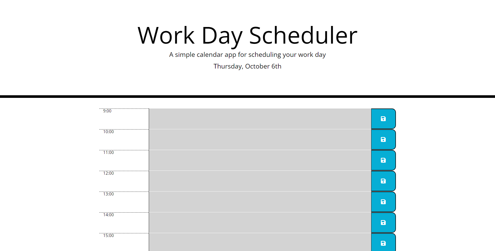

# Module 5 Challenge

## Description

This challenge was to create an application allows the user to create and plan their work day on a scheduler for each hour. This application uses jQuery and momentJS for functionality and browser's local storage to store the user's schedule.

## Installation

N/A

## Usage

To use this webpage, you may open the page using the Github pages link or this [link](https://tkmarsten.github.io/module-5-challenge/).

## Credits

Tiarnan Marsten

## License

Please refer to the LICENSE in the repo.
